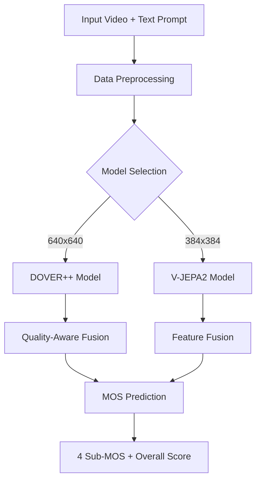

## Overview

QualiVision implements a dual-model architecture for comprehensive video quality assessment of AI-generated content. The system combines two state-of-the-art models (DOVER++ and V-JEPA2) with multi-modal fusion to assess video quality across four critical dimensions.

## High-Level Architecture

The system follows a modular pipeline architecture:



## Component Breakdown

### 1. Data Pipeline

The data pipeline handles video ingestion, frame sampling, and preprocessing:

<Tabs>
  <Tab title="Frame Sampling">
    - **Uniform temporal sampling**: 64 frames extracted uniformly across video duration
    - **Adaptive indexing**: Handles videos shorter or longer than 64 frames
    - **Decord integration**: GPU-accelerated video reading
    
    From `dataset.py:82-96`:
    ```python
    def _sample_frames_manual(self, video_path: Path) -> torch.Tensor:
        vr = VideoReader(str(video_path))
        total_frames = len(vr)
        
        # Sample frames uniformly
        if total_frames <= self.num_frames:
            indices = np.linspace(0, total_frames - 1, self.num_frames).astype(int)
        else:
            indices = np.linspace(0, total_frames - 1, self.num_frames).astype(int)
        
        indices = np.clip(indices, 0, total_frames - 1)
        frames = vr.get_batch(indices)  # Shape: (T, H, W, C)
    ```
  </Tab>
  
  <Tab title="Resolution Adaptation">
    Different models require different input resolutions:
    
    - **DOVER++**: 640×640 resolution for detailed quality assessment
    - **V-JEPA2**: 384×384 resolution for efficient processing
    
    From `config.py:21-42`:
    ```python
    DOVER_CONFIG = {
        "video_resolution": (640, 640),
        "num_frames": 64,
    }
    
    VJEPA_CONFIG = {
        "video_resolution": (384, 384),
        "num_frames": 64,
    }
    ```
  </Tab>
  
  <Tab title="Text Processing">
    Text prompts are encoded using BGE-Large embeddings:
    
    - **Model**: BAAI/bge-large-en-v1.5
    - **Dimension**: 1024 (DOVER++) or 768 (V-JEPA2)
    - **Normalization**: L2 normalized embeddings
    
    From `dataset.py:258-268`:
    ```python
    with torch.no_grad():
        text_emb = self.text_encoder.encode(
            prompts,
            convert_to_tensor=True,
            normalize_embeddings=True,
            device=self.device,
            batch_size=len(prompts)
        )
    ```
  </Tab>
</Tabs>

### 2. Model Components

<CardGroup cols={2}>
  <Card title="DOVER++ Model" icon="cube">
    - **Backbone**: ConvNeXt 3D (768 channels)
    - **Parameters**: ~120M
    - **Input**: 640×640×64 frames
    - **Features**: Separate aesthetic/technical heads
    - **Fusion**: Quality-aware cross-modal attention
  </Card>
  
  <Card title="V-JEPA2 Model" icon="cubes">
    - **Backbone**: Vision-JEPA2 ViT-Giant
    - **Parameters**: ~1.1B (85% frozen)
    - **Input**: 384×384×64 frames
    - **Features**: Strategic layer freezing
    - **Fusion**: Concatenation with discriminative learning
  </Card>
</CardGroup>

### 3. Training Pipeline

The training system implements advanced techniques for stable convergence:

<Info>
**Key Training Features**
- **Mixed precision**: FP16/FP32 for memory efficiency
- **Gradient accumulation**: Effective batch sizes of 32-192
- **Discriminative learning rates**: Different rates for encoder/fusion/head
- **Adaptive loss weighting**: Dynamic adjustment during training
</Info>

From `config.py:59-76`:
```python
TRAINING_CONFIG = {
    "device": "cuda",
    "mixed_precision": True,
    "gradient_clipping": 1.0,
    "warmup_steps": 100,
    "max_grad_norm": 1.0,
    "weight_decay": 1e-2,
    "scheduler": "cosine",
}
```

### 4. Evaluation System

Multi-metric evaluation for comprehensive assessment:

- **Spearman Correlation (SROCC)**: Rank-order correlation
- **Pearson Correlation (PLCC)**: Linear correlation
- **Per-dimension metrics**: Separate evaluation for each quality aspect

## Data Flow Explanation

### Training Flow

1. **Video Loading**: Videos are loaded from disk using Decord VideoReader
2. **Frame Sampling**: 64 frames uniformly sampled from each video
3. **Preprocessing**: Frames resized to target resolution (640×640 or 384×384)
4. **Text Encoding**: Prompts encoded to dense embeddings using BGE-Large
5. **Model Forward Pass**:
   - Video features extracted by ConvNeXt 3D or ViT-Giant
   - Text features projected to common dimension
   - Cross-modal fusion combines video and text
6. **MOS Prediction**: Fusion features predict 5 MOS scores
7. **Loss Computation**: Hybrid loss (smooth L1 + ranking + scale-aware)
8. **Backpropagation**: Discriminative learning rates update parameters

### Inference Flow

1. **Input**: Single video + text prompt
2. **Preprocessing**: Frame sampling and resolution adaptation
3. **Feature Extraction**: Parallel video and text encoding
4. **Fusion**: Quality-aware feature combination
5. **Prediction**: 5 MOS scores (Traditional, Alignment, Aesthetic, Temporal, Overall)
6. **Output**: Normalized scores in 1-5 range

## How the Pieces Fit Together

<Steps>
  <Step title="Data Ingestion">
    Videos and prompts loaded from TaobaoVD-GC dataset
  </Step>
  
  <Step title="Parallel Processing">
    Video encoder (DOVER++/V-JEPA2) and text encoder (BGE-Large) process inputs simultaneously
  </Step>
  
  <Step title="Multi-Modal Fusion">
    Cross-modal attention or concatenation combines video and text features based on quality aspects
  </Step>
  
  <Step title="Quality Prediction">
    MOS prediction head generates 5 scores covering all quality dimensions
  </Step>
  
  <Step title="Loss Optimization">
    Hybrid loss function balances regression accuracy, ranking consistency, and scale awareness
  </Step>
</Steps>

## Memory and Performance

<Tabs>
  <Tab title="DOVER++">
    - **GPU Memory**: ~12GB
    - **Batch Size**: 4 samples
    - **Effective Batch**: 32 (with gradient accumulation)
    - **Training Time**: ~5 epochs
  </Tab>
  
  <Tab title="V-JEPA2">
    - **GPU Memory**: ~16GB
    - **Batch Size**: 6 samples
    - **Effective Batch**: 192 (with gradient accumulation)
    - **Training Time**: ~10 epochs
    - **Memory Savings**: 85% parameter freezing
  </Tab>
</Tabs>

<Note>
**Design Philosophy**: QualiVision prioritizes modularity and extensibility. Each component (data loading, model architecture, fusion mechanism, prediction head) can be independently modified or replaced without affecting the entire system.
</Note>

## Related Topics

<CardGroup cols={2}>
  <Card title="DOVER++ Model" icon="brain" href="/concepts/dover-model">
    Deep dive into the DOVER++ architecture
  </Card>
  
  <Card title="V-JEPA2 Model" icon="microchip" href="/concepts/vjepa-model">
    Explore the V-JEPA2 implementation
  </Card>
  
  <Card title="Quality Dimensions" icon="gauge" href="/concepts/quality-dimensions">
    Understanding the 4 quality metrics
  </Card>
  
  <Card title="Data Preprocessing" icon="filter" href="/concepts/data-preprocessing">
    Details on data preparation pipeline
  </Card>
</CardGroup>